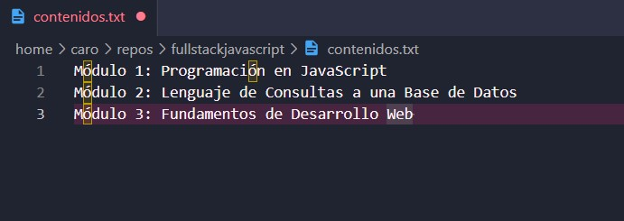
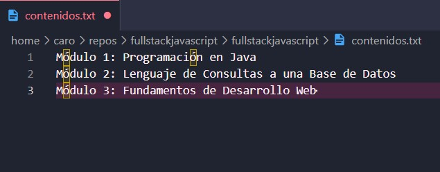

# Ejercicio n°7 Módulo 2 
## Aprendiendo a utilizar git

- Nombre: Carolina Sáez Redital
__________________________________________________________

## Procedimiento


### Creación de carpeta, repositorio y verificación de éste:


```bash
caro@DESKTOP-VKOLQ45:~/repos$ mkdir fullstackjavascript
caro@DESKTOP-VKOLQ45:~/repos$ cd fullstackjavascript/
caro@DESKTOP-VKOLQ45:~/repos/fullstackjavascript$ mkdir fullstackjavascript
caro@DESKTOP-VKOLQ45:~/repos/fullstackjavascript$ cd fullstackjavascript/
caro@DESKTOP-VKOLQ45:~/repos/fullstackjavascript/fullstackjavascript$ git init
Initialized empty Git repository in /home/caro/repos/fullstackjavascript/fullstackjavascript/.git/
caro@DESKTOP-VKOLQ45:~/repos/fullstackjavascript/fullstackjavascript$ git status
On branch main

No commits yet

nothing to commit (create/copy files and use "git add" to track)
caro@DESKTOP-VKOLQ45:~/repos/
```

### Creación de archivo contenidos.txt





```bash
fullstackjavascript/fullstackjavascript$ touch contenidos.txtcaro@DESKTOP-VKOLQ45:~/repos/fullstackjavascript/fullstackjavascript$ git status
On branch main

No commits yet

Untracked files:
  (use "git add <file>..." to include in what will be committed)
        contenidos.txt

nothing added to commit but untracked files present (use "git add" to track)
caro@DESKTOP-VKOLQ45:~/repos/fullstackjavascript/fullstackjavascript$ git commit -m "Agregado contenido.txt"
On branch main

Initial commit

Untracked files:
  (use "git add <file>..." to include in what will be committed)
        contenidos.txt

nothing added to commit but untracked files present (use "git add" to track)
caro@DESKTOP-VKOLQ45:~/repos/fullstackjavascript/fullstackjavascript$ git status
On branch main

No commits yet

Untracked files:
  (use "git add <file>..." to include in what will be committed)
        contenidos.txt

nothing added to commit but untracked files present (use "git add" to track)
```
### Añadiendo el archivo al repositorio


```bash
caro@DESKTOP-VKOLQ45:~/repos/fullstackjavascript/fullstackjavascript$ git add contenidos.txt
caro@DESKTOP-VKOLQ45:~/repos/fullstackjavascript/fullstackjavascript$ git commit -m "Agregado contenidos.txt"
[main (root-commit) e725f40] Agregado contenidos.txt
 1 file changed, 0 insertions(+), 0 deletions(-)
 create mode 100644 contenidos.txt
caro@DESKTOP-VKOLQ45:~/repos/fullstackjavascript/fullstackjavascript$ git status
On branch main
nothing to commit, working tree clean
caro@DESKTOP-VKOLQ45:~/repos/fullstackjavascript/fullstackjavascript$ code contenidos.txt
caro@DESKTOP-VKOLQ45:~/repos/fullstackjavascript/fullstackjavascript$ git status
On branch main
Changes not staged for commit:
  (use "git add <file>..." to update what will be committed)
  (use "git restore <file>..." to discard changes in working directory)
        modified:   contenidos.txt

no changes added to commit (use "git add" and/or "git commit -a")
caro@DESKTOP-VKOLQ45:~/repos/fullstackjavascript/fullstackjavascript$ git log
commit e725f400c1b03d5549a00691b934db1fd9caa93e (HEAD -> main)
Author: caredital <redital.c@gmail.com>
Date:   Tue Apr 11 19:16:05 2023 -0400

    Agregado contenidos.txt
caro@DESKTOP-VKOLQ45:~/repos/fullstackjavascript/fullstackjavascript$ ls -l
total 4
-rw-r--r-- 1 caro caro 126 Apr 11 19:18 contenidos.txt
caro@DESKTOP-VKOLQ45:~/repos/fullstackjavascript/fullstackjavascript$ du -h contenidos.txt
4.0K    contenidos.txt
caro@DESKTOP-VKOLQ45:~/repos/fullstackjavascript/fullstackjavascript$ git commit -m "Primera versión del temario subida al repositorio"
On branch main
Changes not staged for commit:
  (use "git add <file>..." to update what will be committed)
  (use "git restore <file>..." to discard changes in working directory)
        modified:   contenidos.txt

no changes added to commit (use "git add" and/or "git commit -a")
caro@DESKTOP-VKOLQ45:~/repos/fullstackjavascript/fullstackjavascript$ git add contenidos.txt
caro@DESKTOP-VKOLQ45:~/repos/fullstackjavascript/fullstackjavascript$ git commit -m "Primera versión del temario subida al repositorio"
[main 8ff16f1] Primera versión del temario subida al repositorio
 1 file changed, 3 insertions(+)
caro@DESKTOP-VKOLQ45:~/repos/fullstackjavascript/fullstackjavascript$ git status
On branch main
nothing to commit, working tree clean
caro@DESKTOP-VKOLQ45:~/repos/
```

### Modificando el archivo y añadiéndolo al repositorio



```bash
fullstackjavascript/fullstackjavascript$ code contenidos.txt
caro@DESKTOP-VKOLQ45:~/repos/fullstackjavascript/fullstackjavascript$ git status
On branch main
Changes not staged for commit:
  (use "git add <file>..." to update what will be committed)
  (use "git restore <file>..." to discard changes in working directory)
        modified:   contenidos.txt

no changes added to commit (use "git add" and/or "git commit -a")
caro@DESKTOP-VKOLQ45:~/repos/fullstackjavascript/fullstackjavascript$ git add contenidos.txt
caro@DESKTOP-VKOLQ45:~/repos/fullstackjavascript/fullstackjavascript$ git status
On branch main
Changes to be committed:
  (use "git restore --staged <file>..." to unstage)
        modified:   contenidos.txt

caro@DESKTOP-VKOLQ45:~/repos/fullstackjavascript/fullstackjavascript$ git commit -m "Versión actualizada del contenido"
[main dcc80d7] Versión actualizada del contenido
 1 file changed, 2 insertions(+), 1 deletion(-)
```

### Registro de modificaciones en el repositorio

```bash
caro@DESKTOP-VKOLQ45:~/repos/fullstackjavascript/fullstackjavascript$ git log
commit dcc80d75a843b481c513192cae2bdf4aeb4c9d4f (HEAD -> main)
Author: caredital <redital.c@gmail.com>
Date:   Tue Apr 11 19:27:14 2023 -0400

    Versión actualizada del contenido

commit 8ff16f12e04880b53f293362b3f64ef28b76ad31
Author: caredital <redital.c@gmail.com>
Date:   Tue Apr 11 19:24:35 2023 -0400

    Primera versión del temario subida al repositorio

commit e725f400c1b03d5549a00691b934db1fd9caa93e
Author: caredital <redital.c@gmail.com>
Date:   Tue Apr 11 19:16:05 2023 -0400

    Agregado contenidos.txt
caro@DESKTOP-VKOLQ45:~/repos/fullstackjavascript/fullstackjavascript$
```